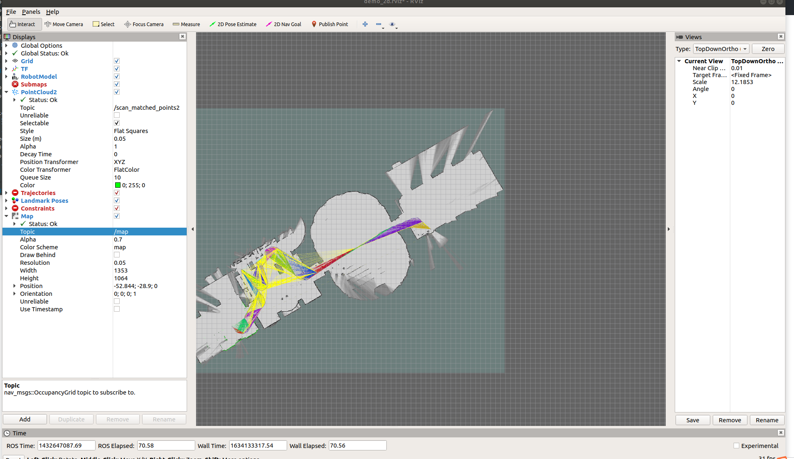

[TOC]

官方的教程在此：

[cartographer官方教程](https://google-cartographer-ros.readthedocs.io/en/latest/)

不过因为墙的原因，获取工程包的时候就寄了(但是我vpn能用啊，为什么为什么？？？)

具体是在这一步的时候错了：

```bash
wstool merge -t src https://raw.githubusercontent.com/cartographer-project/cartographer_ros/master/cartographer_ros.rosinstall
```

没办法只能自己一步步找资源，一共需要3个部分：

1. **ceres solver**
2. **cartographer**
3. **cartographer_ros**

具体步骤如下：

1. 下载相关依赖：

   ```bash
   sudo apt-get install -y google-mock libboost-all-dev  libeigen3-dev libgflags-dev libgoogle-glog-dev liblua5.2-dev libprotobuf-dev  libsuitesparse-dev libwebp-dev ninja-build protobuf-compiler python-sphinx  ros-melodic-tf2-eigen libatlas-base-dev libsuitesparse-dev liblapack-dev
   
   ```

2. 下载**ceres solver**

   官方推荐的下法是直接git clone官方的资源，但还是被墙了┑(￣Д ￣)┍，因为以前配过一次，所以留下了压缩包，也上传到了github上：

   [ceres solver — Dangko](https://github.com/Dangko/ceres-solver)

   下载完后在依次终端运行以下命令：

   ```bash
   cd ceres-solver/build
   cmake ..
   make -j
   sudo make install
   ```

3. 下载**cartographer**和**cartographer_ros**

   话不多说，下面是github链接，直接把工作空间好了，移植的时候记得先把build和devel文件夹删除：

   [cartographer — Dangko](https://github.com/Dangko/cartographer)

   如果直接编译，可能会存在一些路径不匹配问题，假如遇到了，首先把cartographer文件夹里的build文件夹清空，再依次执行下列指令：

   ```bash
   sudo apt-get install -y python3-wstool python3-rosdep ninja-build stow
   cd cartographer/build
   cmake .. -G Ninja
   ninja
   ninja test
   sudo ninja install
   ```

   接着需要下载一个 [abseil-cpp](https://abseil.io/) Library，启动**cartographer**内script文件夹里的install_abseil.sh文件即可：

   ```bash
   src/cartographer/scripts/install_abseil.sh
   ```

   src为工作空间的包目录

   本人git上的为已经安装过的，不清楚在移植的时候是否会存在路径或版本冲突问题，若有，可以尝试官网的卸载教程：

   [Google官方教程](https://google-cartographer-ros.readthedocs.io/en/latest/compilation.html#system-requirements)

   接着直接编译整个工作空间即可：

   ```bash
   catkin_make_isolated --install --use-ninja
   ```


题外话：

在上面的教程里出现了ninja这个东西，Ninja 是Google的一名程序员推出的注重速度的构建工具，一般在Unix/Linux上的程序通过make/makefile来构建编译，而Ninja通过将编译任务并行组织，大大提高了构建速度，u1s1这玩意是真的快，只用**catkin_make_isolated**编译起来非常慢


在配置好后来跑跑例程吧！

首先下载官方的示例bag，复制下列网址到浏览器，并使用下面的标签命名，bag约为470M，储存路径默认为 **/home/username/Downloads**

[cartographer_paper_deutsches_museum.bag](https://storage.googleapis.com/cartographer-public-data/bags/backpack_2d/cartographer_paper_deutsches_museum.bag )

source一下工作空间，launch例程：

`roslaunch cartographer_ros demo_backpack_2d.launch bag_filename:=${HOME}/Downloads/cartographer_paper_deutsches_museum.bag`

在rviz中可以看到雷达的实时数据，添加add Map类型信息，订阅"/map" topic，显示结果如下：

